# Alohamora!

## Phase I: Boundary Detection using Probability of Boundary Method
The aim of a boundary detection algorithm is to achieve image segmentation by identifying boundaries between different objects or regions within an image. Classical edge detection algorithms, including the Canny and Sobel baselines we will compare against, look for intensity discontinuities within an image to detect boundaries.

The more recent pb (**probability of boundary**) boundary detection algorithm significantly outperforms these classical methods by considering texture and color discontinuities in addition to intensity discontinuities.

### Running the package
This package was built using Python 3.7 and OpenCV on Ubuntu 20.04. Follow the instructions on [this](https://docs.opencv.org/3.4/d2/de6/tutorial_py_setup_in_ubuntu.html) page to setup OpenCV for Ubuntu. Other packages include `matplotlib`, `scipy` and `scikitlearn`. These are relatively easy to install using `pip install *package_name*`. 

Download the package:
```
git clone git@github.com:latent-pixel/Boundary-Detection.git
```
Then, from the package's root directory, use the following command to run it:
```
python3 phase1/code/Wrapper.py
```
The results can then be found in a separate `results` folder in the package.

### Filter Bank Generation
Filter bank is a collection of different filters: Oriented Difference of Gaussian (DOG), Leung-Malik (LM), and Gabor filters. This filter bank helps us capture the texture properties of an image. The filter bank generated is shown in the images below.

DOG Filters             |  Leung-Malik Filters             |  Gabor Filters
:-------------------------:|:-------------------------:|:-------------------------:
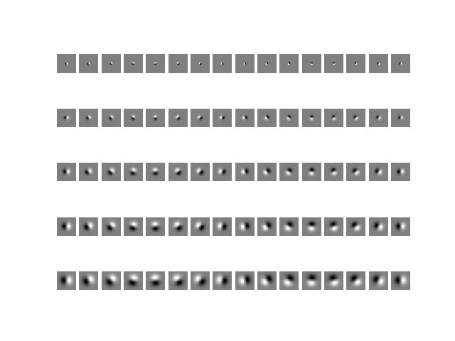  |  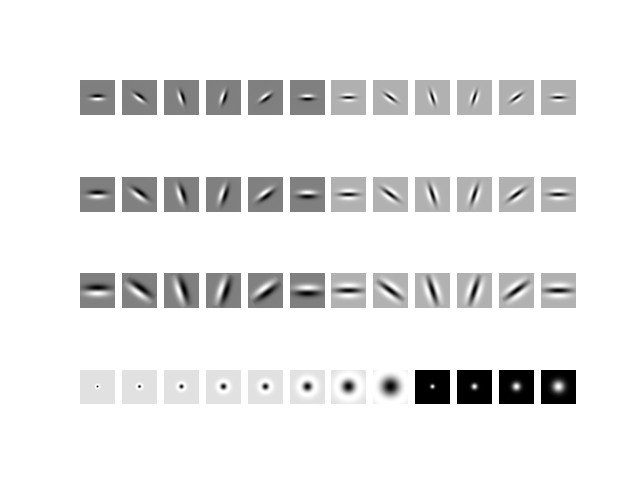  |  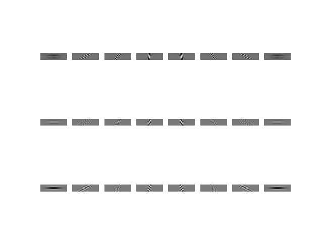

### Sample Output
Texture Map             |  Brightness Map             |  Color Map
:-------------------------:|:-------------------------:|:-------------------------:
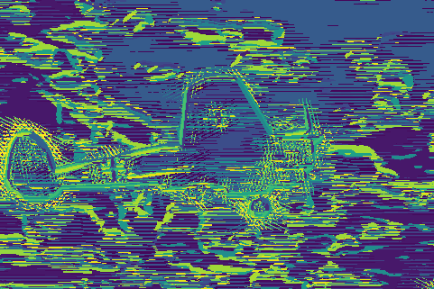  |  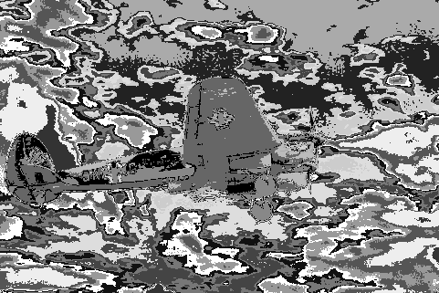  |  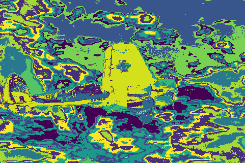

Texture Gradients              |  Brightness Gradients             |  Color Gradients
:-------------------------:|:-------------------------:|:-------------------------:
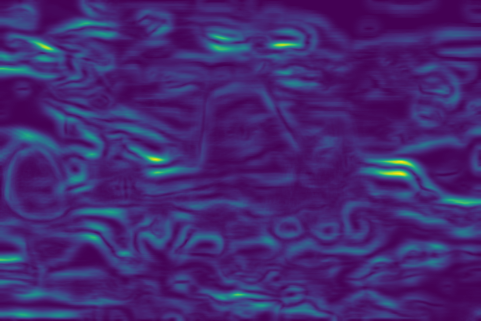  |  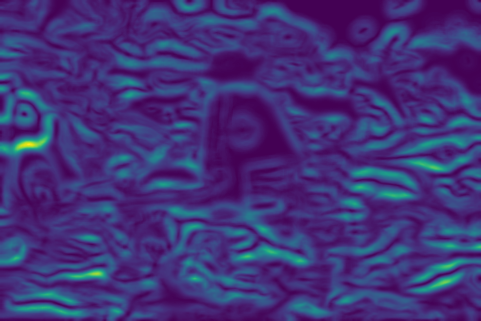  |  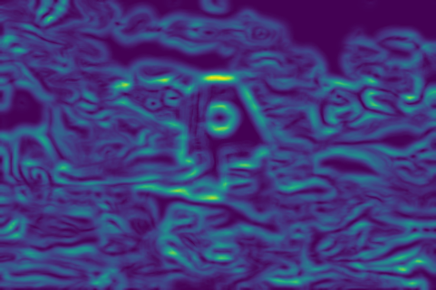

Ouput of the `Pb-lite algorithm` compared with `Canny` and `Sobel` baselines:
Canny Baseline              |  Sobel Baseline             |  Pb-lite Ouput
:-------------------------:|:-------------------------:|:-------------------------:
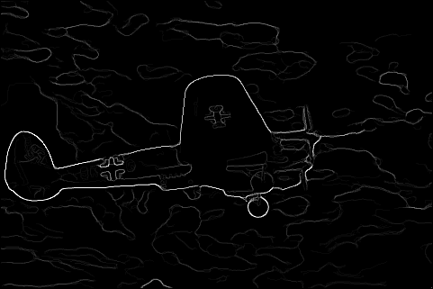  |    |  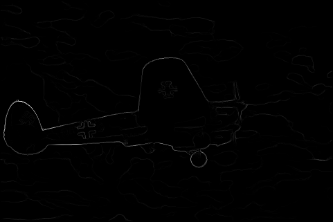

<br>

## Phase II: Deep Dive into Deep Learning
In this section, various (important) neural network architectures are implemented and tested. We also compare them on various criteria such as the number of parameters, train-test accuracies and determine why one architecture works better than the other.

### Running the package
Download the data required for the package (CIFAR10 dataset) from [this]() link.
Since the package has already been downloaded - from the package's root directory, use the following commands for training/inference respectively:
```
python phase2/code/train.py --DataPath --CheckPointPath --LogsPath --NumEpochs --DivTrain --MiniBatchSize --LoadCheckPoint
``` 
```
python phase2/code/test.py --DataPath --ModelPath
```
Use `--help` argument for further explanation on the arguments.

### Model Architectures
To start out, we build a basic CNN inspired from **LeNet-5** by *Yann LeCun*. We then move on to seminal works in the field, such as **ResNet**, **ResNeXt** and **DenseNet**. Model architectures are shown below.

---------------Image(s) here----------------------

### Results
The plots below contain information from 2 different runs, both use SGD as optmizer with different learning rates.


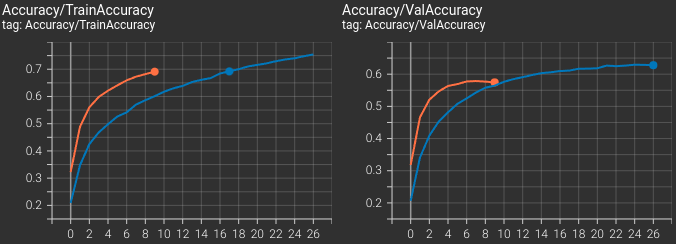
*Train|Test Accuracies. Orange line - SGD with 0.1 learning rate, Blue line - SGD with 0.01 learning rate. Both runs were stopped when their validation loss started to rise.*

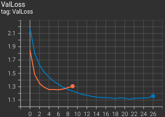
*Validation Loss. Orange line - SGD with 0.1 learning rate, Blue line - SGD with 0.01 learning rate. Both runs were stopped when their validation loss started to rise beyond a level.*

The results on the test set are shown in the graphic below.
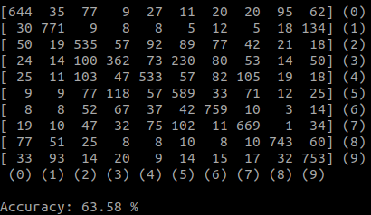
*Confusion matrix - $M_{ij}$ denotes the number of samples at $i^{th}$ row - Ground truth values and $j^{th}$ column - predicted values. Model trained for 25 epochs, SGD with 0.01 learning rate.*