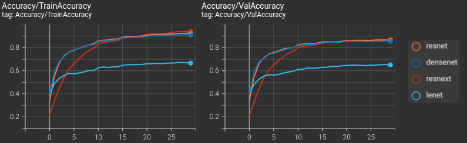

# Alohomora!

## Phase I: Boundary Detection using Probability of Boundary Method
The recent pb (**probability of boundary**) boundary detection algorithm significantly outperforms classical methods such as Canny and Sobel methods by considering texture and color discontinuities in addition to intensity discontinuities. We will implement a simplified version of the pb method: **pb-lite** method!

### Running the package
This package was built using Python 3.7, Pytorch and OpenCV on Ubuntu 20.04. Follow the instructions on [this](https://pytorch.org/get-started/locally/) page to setup Pytorch and [this](https://docs.opencv.org/3.4/d2/de6/tutorial_py_setup_in_ubuntu.html) page to setup OpenCV for Ubuntu. Other packages include `matplotlib`, `scipy` and `scikitlearn`. These are relatively easy to install using `pip install *package_name*`. 

Download the package:
```
git clone git@github.com:latent-pixel/Alohomora.git
```
Then, from the package's root directory, use the following command to run it:
```
python3 phase1/code/Wrapper.py
```
The results can then be found in a separate `results` folder in the package.

### Filter Bank Generation
Filter bank is a collection of different filters: Oriented Difference of Gaussian (DOG), Leung-Malik (LM), and Gabor filters. This filter bank helps us capture the texture properties of an image.

DOG Filters             |  Leung-Malik Filters             |  Gabor Filters
:-------------------------:|:-------------------------:|:-------------------------:
  |    |  

### Sample Output
Texture Map             |  Brightness Map             |  Color Map
:-------------------------:|:-------------------------:|:-------------------------:
  |    |  

Texture Gradients              |  Brightness Gradients             |  Color Gradients
:-------------------------:|:-------------------------:|:-------------------------:
  |    |  

Ouput of the `Pb-lite algorithm` compared with `Canny` and `Sobel` baselines:
Canny Baseline              |  Sobel Baseline             |  Pb-lite Ouput
:-------------------------:|:-------------------------:|:-------------------------:
  |    |  

<br>

## Phase II: Deep Learning Deep Dive
In this section, various (important) neural network architectures are implemented and tested. We also compare them on various criteria such as the number of parameters, train-test accuracies and determine why one architecture works better than the other.

### Running the package
Download the data required for the package (CIFAR10 dataset) from [here]().
Since the package has already been downloaded - from the package's root directory, use the following commands for training/inference respectively:
```
python phase2/code/train.py --ModelArch=<ModelArchitecture> --DataPath=<DataDirectory> --CheckPointPath=<YourCheckPointDir> --LogsPath=<YourLogsDir> --NumEpochs=<Epochs> --DivTrain=<int> --MiniBatchSize=<int> --LoadCheckPoint=<bool>
``` 
```
python phase2/code/test.py --ModelArch=<ModelArchitecture> --DataPath=<DataDirectory> --ModelPath=<ModelPath>

```
Use `--help` argument for further explanation on the arguments.

### Results
To start out, we build a basic CNN inspired from **LeNet** by *Yann LeCun*. We then move on to the more recent seminal works in the field, such as **ResNet**, **ResNeXt** and **DenseNet**. This is a brief summary of the results obtained.

All the models were trained using the same train-validation-test split, data augmentation and training regime, details of which are given below:

1. **Dataset**:  CIFAR10+ (random flipping, and cropping from 40x40 padded image)
2. **Train-Validation-Test Split**: 45000-5000-10000
3. **Optimizer**: SGD with momentum of 0.9 and learning rate of 0.1
4. **Mini-batch size**: 32 (varies in accordance with the "hybrid method" proposed in [this](https://arxiv.org/pdf/1711.00489.pdf) paper)
5. **Epochs**: 30


Train-Test Accuracies |                  
:-------------------------:|

*Results for ResNet-18, ResNeXt-29 and DenseNet-40*|

Validation Loss             |  Results
:-------------------------:|:-------------------------:|
 | 


## Acknowledgements

Although significant changes have been made, the code for Phase II of this project was based on / inspired by the starter code provided in WPI's RBE549 (Computer Vision). [This](https://rbe549.github.io/spring2023/hw/hw0/) is the link to their project page.

